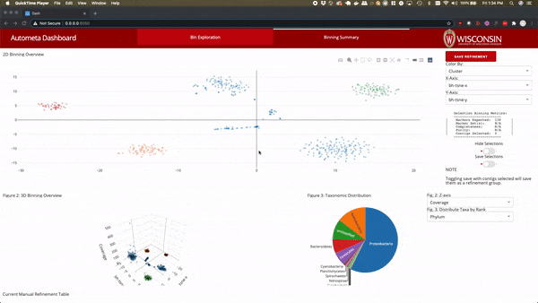

Automappa
=========


An interactive interface for exploration of highly complex metagenomes
----------------------------------------------------------------------



### Quickstart using Docker (Easiest and Quickest):

 To start quickly start exploring your data, run the app using a wrapper script that will run the docker image, `evanrees/automappa:latest`, ([available from Dockerhub](https://cloud.docker.com/repository/docker/evanrees/automappa/tags "Automappa Dockerhub Tags")). Now you can skip installation and start binning, examining and describing! Let the microbial exegesis begin!

```bash
# Wrapper available to run docker with port-forwarding.
curl -o run_automappa https://raw.githubusercontent.com/WiscEvan/Automappa/main/docker/run_automappa
chmod a+x run_automappa

# Now run automappa using wrapper script: `run_automappa`
# NOTE: This will pull the automappa docker image if it is not already available.
./run_automappa <path/to/recursive_dbscan_output.tsv>
```

### Installation

You can install all of Automappa's dependencies using the Makefile found within the repository.

```bash
cd $HOME
git clone https://github.com/WiscEvan/Automappa.git
cd $HOME/Automappa

# List available commands
make
# pull docker image
make docker
```

### Quickstart from source

```bash
# First create environment
make create_environment
# Activate environment
source activate automappa
# The following will install dependencies and download test data then start automappa
make test
```

Now that all of the dependencies are installed, you may run the app on your local machine or on a server.

## Usage:

### Local Usage:

```bash
cd $HOME/Automappa
python index.py -i <path/to/recursive_dbscan_output.tab>
```

### Remote:

If you'd like to run the app on the server but view the output on your local machine, you first need to login to the server with a tunnel.

```bash
#ssh -L localport:127.0.0.1:serverport user@kwan-bioinformatics.pharmacy.wisc.edu
#example
ssh -L 6920:127.0.0.1:8050 jkwan@kwan-bioinformatics.pharmacy.wisc.edu
```

Now once you're on the server, navigate to your Automappa repository and start the Automappa server.

```bash
cd $HOME/Automappa && python index.py -i <path/to/recursive_dbscan_output.tab>
```

Navigate to the app view in your browser. This will correspond to the localport that was passed in upon login to the remote server. In the previous example above we would navigate to `localhost:6920`.

If you'd like to run the app on the server but view the output on your local machine, you first need to login to the server with a tunnel (`ssh -L localport:localhost:serverport user@hostaddress`).

```bash
#ssh -L localport:localhost:serverport user@kwan-bioinformatics.pharmacy.wisc.edu
ssh -L 8888:localhost:8050 jkwan@kwan-bioinformatics.pharmacy.wisc.edu

# Wrapper available to run docker with port-forwarding.
curl -o run_automappa https://raw.githubusercontent.com/WiscEvan/Automappa/main/docker/run_automappa
chmod a+x run_automappa

# Now run automappa using wrapper script: `run_automappa`
# NOTE: This will pull the automappa docker image if it is not already available.
./run_automappa <path/to/recursive_dbscan_output.tsv>
```

Now navigate to `http://localhost:8888` and you will see the loaded data.

I've numbered the ports here to help illustrate the network communication.

#### Example port forwarding breakdown
| Server | Port |
| :------------- | :------------- |
| Docker container | 8886 |
| Remote Server | 8887 |
| Local Computer | 8888 |

#### Note:
- You may change **any** of these values as long as you change the respective value.
- This will be most useful if **multiple users** will need to use the app.

| Bridge | Port Bridge | Communication Context |
| :------------- | :------------- | :------------- |
| remote_server_port:container_port | 8887:8886 | [bioinformatics\|CHTC server]:docker |
| localhost_port:remote_server_port | 8888:8887 | local machine:[bioinformatics\|CHTC server] |
