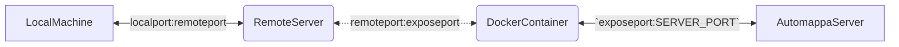
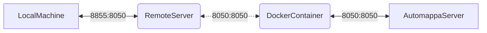

# Using Automappa on a remote server

Follow these steps if you would like to run Automappa on a *remote* server
but view the output on your *local* machine.

1. [ssh tunnel at remote server login (`ssh -L localport:localhost:remoteport`)](#remote-server-login-with-ssh-tunnel)
2. [Configure server host and port in `.env`](#configure-server-host-and-port)
3. [Expose configured port in `docker-compose.yml`](#expose-configured-port-in-docker-composeyml)
4. [Start Automappa services](#start-automappa-services)

- [network configuration illustration](#network-communication-illustration)
- [Example network configuration illustration](#example-network-communication-illustration)

## remote server login with ssh tunnel

you first need to login to the remote server with a tunnel, e.g. `ssh -L localport:localhost:serverport user@hostaddress`.

```bash
#ssh -L localport:127.0.0.1:serverport user@kwan-bioinformatics.pharmacy.wisc.edu
#example
ssh -L 8855:127.0.0.1:8050 sam@kwan-bioinformatics.pharmacy.wisc.edu
```

## Configure server host and port

Once you are on the server, simply start the Automappa server (with the appropriate port from the ssh tunnel).

To set the `serverport` to correspond to the port defined in the ssh tunnel, edit the `.env` file:

```bash
# Note these values in .env
SERVER_HOST="0.0.0.0"
SERVER_PORT=8050
```

This means the server port (on the remote server) will be `8050`

## Expose configured port in `docker-compose.yml`

The port exposed in the `web` service defined in `docker-compose.yml` must also be changed to correspond to the user's values.

The `SERVER_PORT` in `.env` should match the exposed port for Automappa's web service
(i.e. the `web` service in the `docker-compose.yml` file).

```yaml
# Contents of docker-compose.yml
# ... more services above hidden ...
# Find this section
web:
    build:
      context: .
      dockerfile: Dockerfile
    restart: always
    mem_limit: 4GB
    command: python -m automappa.__main__
    user: automappa
    volumes:
      - .:/usr/src/app
    ports:
      - "8050:8050" # edit this line to match SERVER_PORT specified in .env
    # - "remoteport:SERVER_PORT"
    depends_on:
      - postgres
      - queue
```

## Start Automappa services

After configuring the server and host port to match the forwarded ssh tunnel's remote port
start Automappa's services.

> 0. (local machine) ssh tunnel @ login with forwarding port: `ssh -L localport:remoteport`
> 1. (remote server) edit `SERVER_PORT` in `.env` to whatever you prefer
> 2. (remote server) edit `ports: "remoteport:SERVER_PORT"` in `docker-compose.yml`
> 3. (remote server) start Automappa services: `make up`
>
>i.e. in the previous example, these steps would look like this:
>
> 0. (local machine) `ssh -L 8855:8050 user@remote-server`
> 1. (remote server) edit `.env` with changes: `SERVER_PORT = 8050`
> 2. (remote server) edit `web` service port in `docker-compose.yml`: `ports: 8050:8050`
> 3. (remote server) start Automappa services: `make up`

```bash
cd Automappa
make up
```

>NOTE: This will build Automappa and serve using `SERVER_HOST` and `SERVER_PORT` from the configuration in `.env` above.

Once all of the services are up and running you can navigate to the app view in your browser.

This will correspond to the localport that was passed in upon login to the remote server.

> From the login example above we would navigate to [`localhost:8855`](https://localhost:8855).

Here is an illustration of the network communication.

### Network communication illustration



### Example network communication illustration

I've numbered the ports here to help illustrate an example network configuration.



> Note
>
> - You may change **any** of these values as long as you change the respective value.
> - This may be useful if multiple users will need to use the app.

| Bridge | Port Bridge | Communication Context |
| :------------- | :------------- | :------------- |
| `localport:remoteport` | `8855:8050` | `local:remote` |
| `remoteport:containerport` | `8050:8050` | `remote:docker` |
| `containerport:serverport` | `8050:8050` | `docker:server` |
